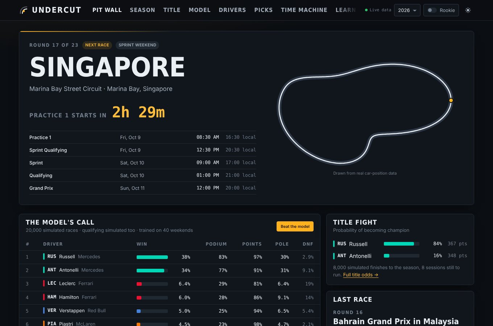
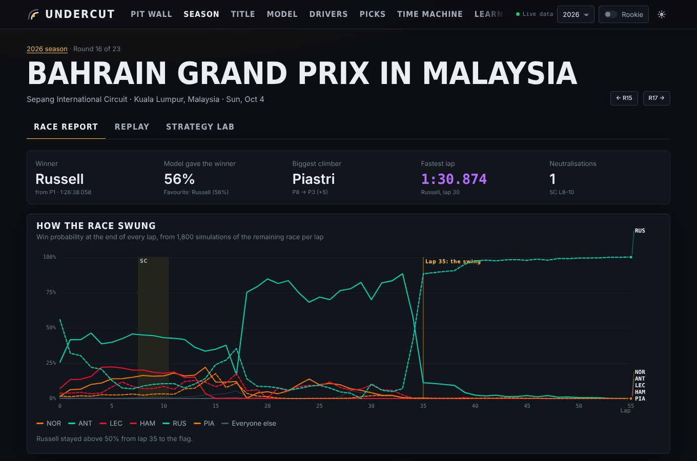
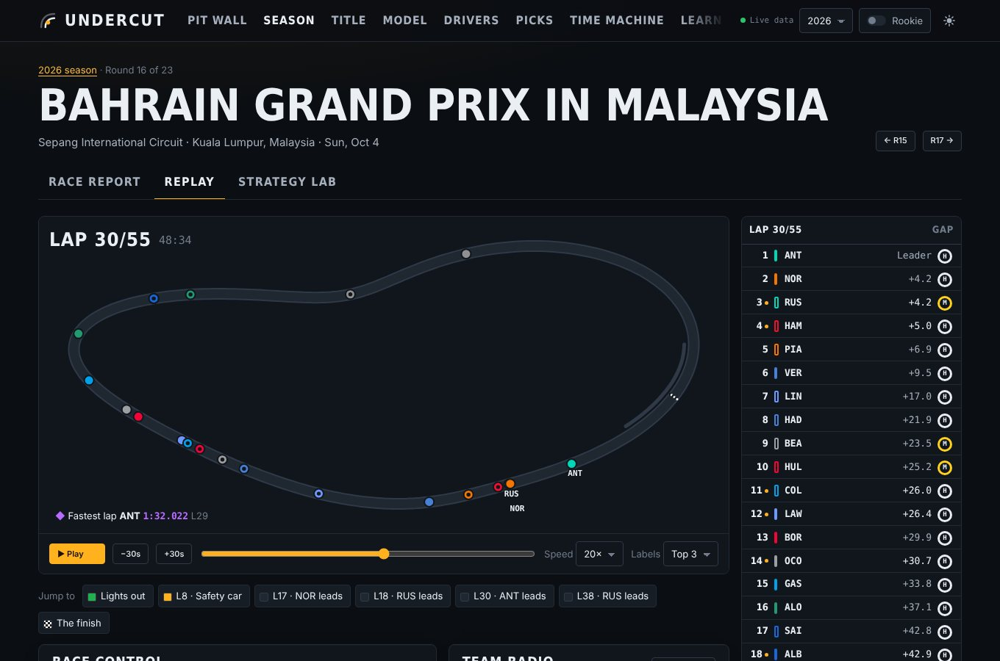
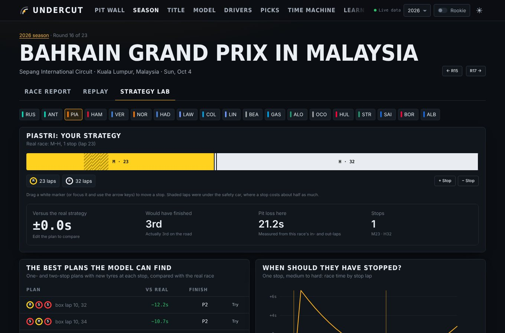
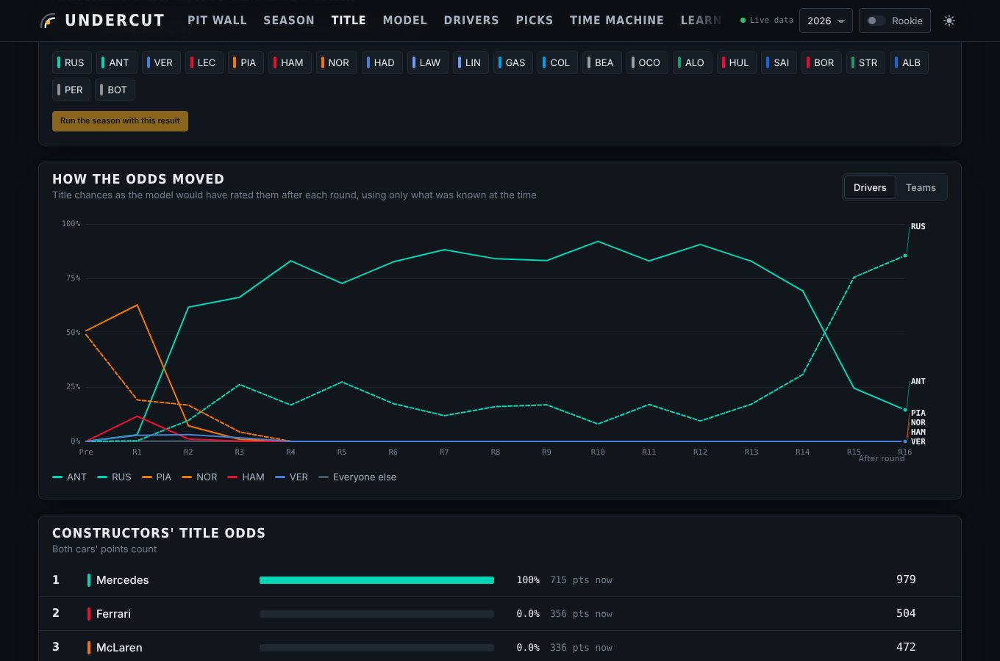

# Undercut

**F1 forecasts that grade themselves.** Undercut is a Formula 1 analytics site that fits a Bayesian ranking model in your browser, simulates every race and the rest of the championship thousands of times, replays real races lap by lap on the actual circuit, and lets you rewrite any driver's pit strategy to see where they would have finished. Then it checks its own homework: every forecast is backtested against what really happened.

It is a static site — no server, no database, no API keys. The browser pulls public timing data from [Jolpica](https://github.com/jolpica/jolpica-f1) and [OpenF1](https://openf1.org) and does everything else itself.



> The screenshots in this README come from the project's test suite, which runs the site against a simulated F1 season. Run normally, the site shows real data.

## What's inside

| Page | What it does |
| --- | --- |
| **Pit Wall** | Countdown to the next session (in your time zone and the circuit's), the model's win / podium / points odds, title odds and the last race at a glance. |
| **Race Centre: preview** | Forecast for the coming race, a finishing-position probability heatmap for every driver, qualifying and sprint results, a race-day rain forecast, the circuit traced from real car positions, and the circuit's history ("Circuit DNA"). |
| **Race Centre: report** | A *swing chart* of every driver's win probability after every lap (re-simulated from each lap's real state), race trace, running order, tyre strategy, fastest pit stops, race control and conditions. |
| **Race Centre: replay** | The whole race on the real circuit at up to 50× speed, with a live timing tower, tyres, safety-car flags, battles, race control, key-moment jumps and team radio. |
| **Race Centre: Strategy Lab** | A tyre-degradation model fitted to the race's own laps. Drag a driver's pit stops, change compounds, and see the time gained or lost and the finishing position it would have meant; it also searches every one- and two-stop plan. |
| **Title** | Championship odds with likely final-points ranges, mathematical elimination and clinch scenarios, a *what-if* tool (fix a future podium, re-run the season), and how the odds moved after every round. |
| **Model Lab** | The model explained, a walk-forward backtest against "grid order" and "anyone can win" baselines, Brier scores, log loss, a calibration plot, and knobs to tune it — including an auto-tuner. |
| **Drivers** | Driver ratings with the car's share removed (with 90% intervals), car ratings, teammate head-to-heads and per-driver profiles. |
| **Picks** | Call the podium before lights out and compete with the model, scored race by race. |
| **Time Machine** | The season re-scored under the points systems of other eras. Would the champion still be champion? |
| **Learn** | F1 in five minutes: weekends, points, tyres, flags, the 2026 rules, an interactive undercut simulator and a searchable glossary. **Rookie mode** explains every piece of jargon anywhere on the site. |

| Race report | Replay |
| --- | --- |
|  |  |
| **Strategy Lab** | **Title odds over the season** |
|  |  |

## Run it

You need [Node.js](https://nodejs.org) 20.6 or newer.

```bash
cd web
npm install
npm run dev          # http://localhost:5173, reloads on save
```

Everything else:

```bash
npm test             # unit and integration tests (Node's built-in runner)
npm run typecheck    # strict TypeScript over the app and the tests
npm run build        # production build into dist/
npm run preview      # serve dist/ locally

npx playwright install chromium   # once, for the browser tests
npm run test:e2e     # builds, then drives every page in a real browser
```

To make it yours, edit `web/src/content/site.ts` (your name, links to your repository and profile).

## Deploy (GitHub Pages)

1. Make the repository public. (Pages on a private repository needs GitHub Pro, which is free with the GitHub Student Developer Pack.)
2. In the repository's **Settings → Pages**, set **Source** to **GitHub Actions**.
3. Move the workflow into place and push to `main`:

   ```bash
   mkdir -p .github/workflows
   git mv web/docs/deploy-web.yml .github/workflows/deploy-web.yml
   git commit -m "Deploy to GitHub Pages" && git push
   ```

   From then on, every push to `main` type-checks, runs the unit and browser tests, builds, and publishes the site at `https://aditya-gupta2307.github.io/undercut/`.

The site uses hash URLs (`/#/race/2026/16`), so every page can be refreshed or shared on any static host without server rules. `dist/` also works on Netlify, Vercel or any web server.

## How it works

```
Jolpica (results)  ┐                 ┌─> models (forecast, title, backtest, ratings, strategy, replay)
OpenF1  (timing)   ├─> rate-limited ─┤
Open-Meteo (rain)  ┘   request queue └─> parsers ─> typed domain model ─> React pages and charts
                       + 3-layer cache
```

**Data.** Raw JSON is turned into typed domain objects in exactly one place (`src/data`). Jolpica and OpenF1 share no keys, so races are matched by time (in 2026 the "Bahrain Grand Prix" ran in Malaysia, and the two sources name it differently) and drivers by car number.

**Being a polite client.** The free APIs allow 4 requests a second (Jolpica) and 30 a minute (OpenF1). A request queue (`src/lib/http.ts`) de-duplicates identical requests, paces them, keeps sliding-window counts that survive a page reload, prioritises what is on screen over prefetching, and backs off on HTTP 429 using `Retry-After`. Responses are cached in memory and in `localStorage`; finished seasons and races are kept for good, live ones refresh. An empty answer ("not published yet") is never cached permanently.

**The model** (`src/model`):

- **Plackett–Luce ranking.** A finishing order is treated as a sequence of choices: the winner is picked from everyone, second from the rest, and so on, each in proportion to `exp(strength)`.
- **Car and driver, separated.** `strength = θ_team + δ_driver + β · (−log grid slot)`. Teammates share θ, so δ measures a driver against identical machinery. Gaussian priors regularise both; the fit is Newton's method with an analytic gradient and Hessian, and the Laplace approximation gives the uncertainty on the Drivers page.
- **Recency.** Results are weighted by `0.5^(races ago / half-life)`, and last season counts less — essential in 2026, when new rules reset the order.
- **Reliability.** A beta-binomial model gives each car a retirement chance, shrunk toward its team and the field.
- **Monte Carlo.** Races (and qualifying, when it has not happened yet) are simulated with Gumbel noise, which samples Plackett–Luce orders exactly; win probabilities are Rao–Blackwellised for lower variance.
- **In-race win probability.** For every lap, the rest of the race is re-simulated from the real gaps, tyres and stops at that moment.
- **Strategy.** A robust least-squares tyre model (driver pace + compound offset + degradation × tyre age + fuel effect) fitted to the race's clean laps.
- **Honesty.** A walk-forward backtest re-forecasts every race using only data available beforehand and scores it with Brier score, log loss and calibration, against two baselines.

**Replay.** Lap timing gives each car's exact line-crossing times; between crossings cars move at an even pace, and pit-stop time is placed in the pit lane. The circuit is traced from one car's position samples during that same race, so the start line and scale are exact. One extra request draws the track.

## Project layout

```
web/
├─ index.html              page shell (fonts, theme bootstrap)
├─ public/                 static files copied as-is (favicon)
├─ scripts/                esbuild-based dev server, build, preview, test runner
├─ src/
│  ├─ main.tsx             entry point
│  ├─ app/                 routing, settings, data hooks, model hooks, caching
│  ├─ data/                API clients and parsers → typed domain model
│  ├─ model/               all statistics and simulation (pure functions, no React)
│  ├─ pages/               one file per page; race/ holds the Race Centre tabs
│  ├─ components/          shared UI, charts, track map, Rookie-mode terms
│  ├─ content/             glossary and site identity
│  ├─ lib/                 HTTP queue, storage, maths, random numbers, formatting
│  └─ styles/              design tokens, components and page styles
└─ tests/
   ├─ unit/                models, parsers, caching, timing reconstruction, replay
   ├─ fake-api/            a physically simulated F1 season served as fake Jolpica,
   │                       OpenF1 and Open-Meteo APIs (consistent across all three)
   └─ e2e/                 Playwright suite plus a screenshot tool
```

## Testing

- **Unit and integration tests** cover the ranking model's gradients and fits, forecasting, the championship simulator (including countback and elimination), backtest scoring, the parsers, race-timing reconstruction, the tyre model and strategy search, the replay, caching, and request budgets against the fake API.
- **The fake API** generates a full season with qualifying, sprints, retirements, safety cars, pit stops and car positions from a physical model, so every page can be tested offline and deterministically.
- **Browser tests** open every page in Chromium against the fake API, exercise the main interactions (replay, strategy editing, what-if, picks, season switching, mobile width, light theme), and fail on any console error or any request to an unexpected host.

Take a screenshot of any page against the fake data (from `web/`):

```bash
node --import tsx tests/e2e/shoot.ts "/race/2026/16?tab=replay" shot.png --wait=6000 --full
```

## Design decisions

- **Static instead of a backend.** Everything the site needs is public, so the browser can fetch it directly. That means free hosting, nothing to keep running, and no API keys — at the cost of doing the computation on the visitor's machine (a forecast takes well under a second on a laptop).
- **esbuild instead of a framework CLI.** The whole build is about a hundred lines in `scripts/`, and the tests run against the same bundle that is deployed.
- **Charts by hand.** d3 provides scales and line generators; the charts themselves are React SVG, designed so that 22 drivers stay readable: a few lines are emphasised in team colours and the rest recede, with a legend, tooltips and table views.

## Known limitations

- Forecasts know nothing about weather, upgrades or penalties announced after qualifying; a wet race is less predictable than any number on the page suggests.
- Between line crossings the replay assumes an even pace; positions are exact at every crossing.
- The tyre model is linear in tyre age, so stints are capped just beyond the longest anyone ran in that race.
- A one-off substitute driver replaces the regular driver in the entry list until the next qualifying session.
- OpenF1's free tier serves data after sessions end, so race pages fill in shortly after the chequered flag rather than live.

## Credits

Data from [Jolpica F1](https://github.com/jolpica/jolpica-f1), [OpenF1](https://openf1.org) and [Open-Meteo](https://open-meteo.com). Team radio audio belongs to Formula 1 and is streamed from its timing service only when you press play.

Undercut is an unofficial fan project and is not associated in any way with the Formula 1 companies. F1, FORMULA ONE, FORMULA 1, FIA FORMULA ONE WORLD CHAMPIONSHIP, GRAND PRIX and related marks are trade marks of Formula One Licensing B.V.
